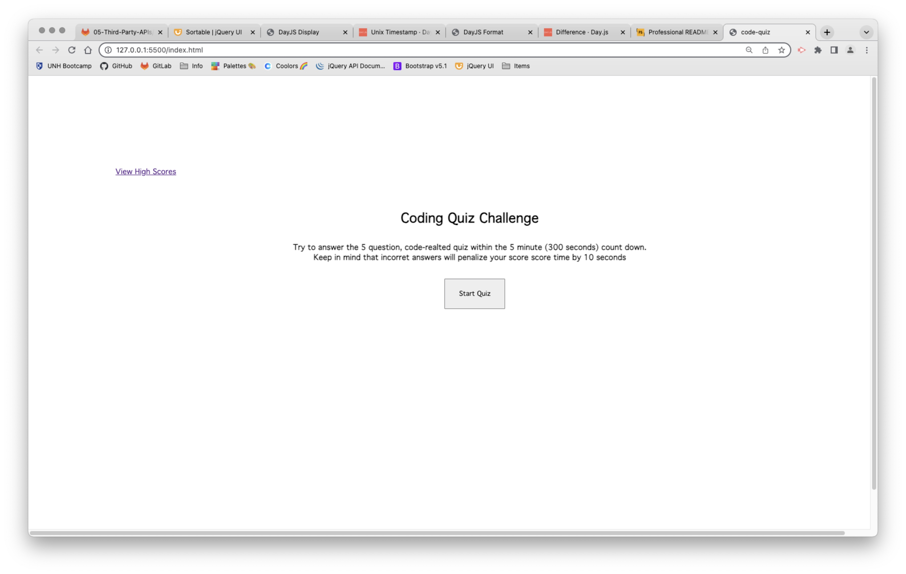
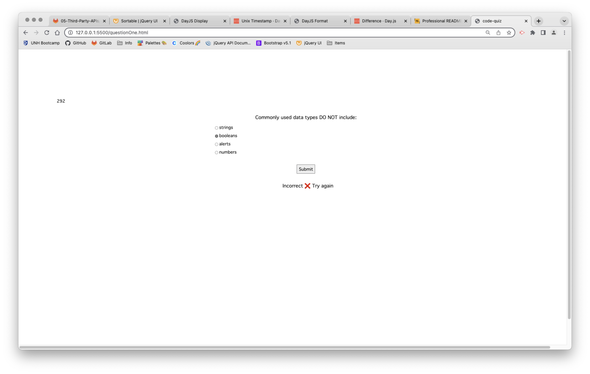
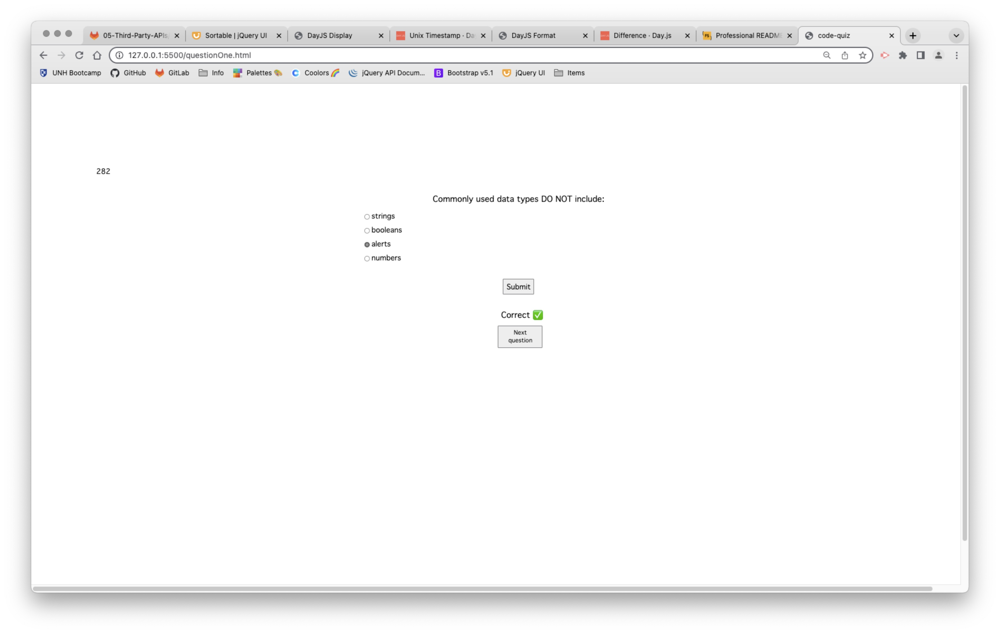
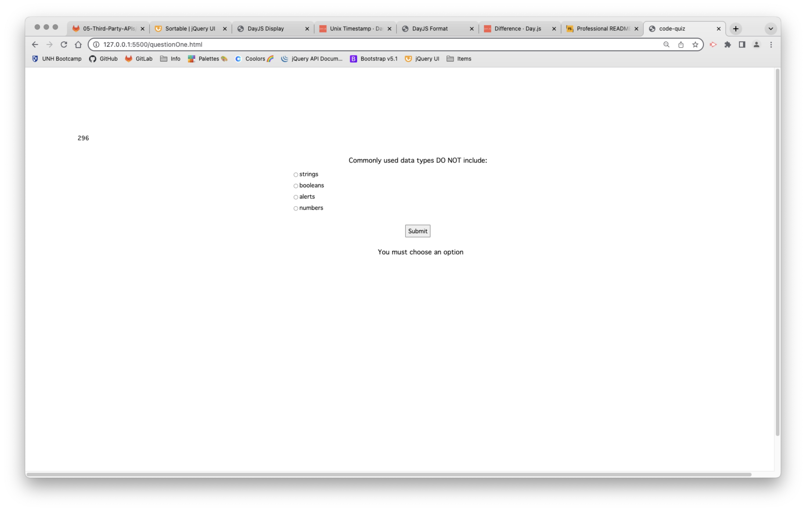

# danielle-code-quiz

## Description
Working on a small coding quiz, mainly to test what I have recently learned regarding web APIs in my class. I am still working on it as the scoreboard is not yet complete, there is also supposed to be a timer that gives you 5 minutes and minuses 10 seconds whenever you get a question wrong, however if you get it the same questuion incorrect multiple times it only minuses the 10 seconds that one time, but as mentioned it is a work in progress. I tried to make corresponding js and htmls thinking it would be easier to keep track of, if I recreated this project I would not do that again but try and keep the same js file for everything.

## Installation
No installation needed, should be accessible on default browser.

## Usage
Click 'start quiz' and then go through answering the questions, if it is incorrect you will get a message saying that it is incorect and to try again, if you don't make a selection the quiz will tell you that you have to make a selection, and if it is correct then you can proceed to the next question.

